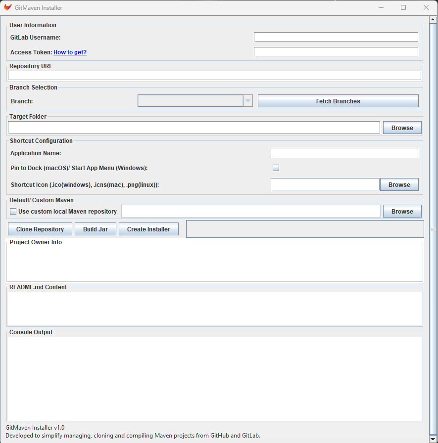

# GitMaven Installer

GitMaven Installer is a cross-platform desktop application designed to simplify the process of cloning Maven-based projects from GitHub or GitLab, building them, and creating launchable shortcuts on Windows, macOS, and Linux systems.

## Developer Setup Notes

To ensure the JAR is runnable with all dependencies included:

### ✅ Maven Assembly Plugin

Add the following plugin configuration to your `pom.xml` to bundle all dependencies into a single runnable JAR:

```xml
<plugin>
    <groupId>org.apache.maven.plugins</groupId>
    <artifactId>maven-assembly-plugin</artifactId>
    <version>3.4.2</version>
    <configuration>
        <finalName>your-project-name</finalName>
        <appendAssemblyId>false</appendAssemblyId>
        <archive>
            <manifest>
                <mainClass>your.package.name.YourMainClass</mainClass>
            </manifest>
        </archive>
        <descriptorRefs>
            <descriptorRef>jar-with-dependencies</descriptorRef>
        </descriptorRefs>
    </configuration>
    <executions>
        <execution>
            <id>make-fat-jar</id>
            <phase>package</phase>
            <goals>
                <goal>single</goal>
            </goals>
        </execution>
    </executions>
</plugin>
```

## Notes:
    Replace your.project.name with your actual project name.

    Replace your.package.name.YourMainClass with the full path to your class that contains public static void main(String[] args).

    appendAssemblyId=false will prevent Maven from appending -jar-with-dependencies to the output JAR file name.

    The jar-with-dependencies descriptor ensures that the JAR includes all external libraries.

## Features

- ✨ Graphical User Interface (GUI) using Java Swing
- 💻 Cross-platform support: **Windows**, **macOS**, and **Linux**
- 🚀 Clone repositories from GitHub/GitLab using HTTPS or SSH
- 📚 Branch selection and fetching
- ⛏ Build Maven projects automatically
- ✅ System requirements check for Java, Git, and Maven
- 🔍 Read and display project README.md
- 📄 Fetch and display project owner info (GitHub/GitLab)
- 🔹 Optional custom Maven repository path
- ⚙ Create OS-specific desktop shortcuts for the built JAR
- 🌟 Custom icon and application name support

## Requirements

Before running GitMaven Installer, ensure the following are installed:

- Java 17+ (tested with Java 21 and Java 24)
- Maven 3.10+
- Git 2.40+

## Installation

1. Clone or download this repository.
2. Build the project using Maven:

```bash
mvn clean install
```

3. Run the application:

```bash
java -jar target/gitmaven-installer.jar
```

## Usage

1. **Launch the Application**: Run the built JAR file.
2. **Check Requirements**: The application checks for Java, Git, and Maven installations.
3. **Enter Repository URL**: Paste the GitHub/GitLab repository URL.
4. **Fetch Branches**: Click to fetch available branches.
5. **Set Install Path**: Choose where the installer should be install.
6. **Custom Maven Repo (Optional)**: Specify a local repository path.
7. **Clone & Build**:
    - Clone the repository.
    - Automatically detect Maven project and build it.
8. **Create Shortcut**:
    - Set application name and icon.
    - Create a shortcut:
        - Windows: `.lnk` in Desktop and optionally Start Menu
        - macOS: `.app` bundle in `~/Applications` with Dock pin option
        - Linux: `.desktop` file or Flatpak package

## Architecture

The application is structured into several key components:

- **UI Layer**: Built with Java Swing, managed in `GitMavenCloneUI.java`.
- **Git Operations**: Classes under `FetchGitInfo` handle cloning, branch fetching, and owner info from GitHub and GitLab.
- **Build System**: Uses `RunMavenBuild.java` and `PomHelper.java` to locate and compile Maven projects.
- **Installer Creation**: Platform-specific logic:
    - `WindowsInstaller.java` using `mslinks`
    - `MacInstaller.java` using AppleScript and `.app` bundles
    - `LinuxInstaller.java` supporting both `.desktop` and Flatpak manifests
- **Helpers**: Utilities like `JarFinder.java`, `OperationSystemChecker.java`, and `RepositoryHelper.java`
- **Validation**: `RequirementsChecker.java` checks for Java, Git, and Maven and prompts user before continuing


## Screenshots


## Supported Repository Hosts

- GitHub (public and private)
- GitLab (with optional access token)

## Developer Notes

- This tool uses `mslinks` for Windows shortcut creation.
- On macOS, AppleScript is used to create `.app` bundles and Dock integration.
- On Linux, Flatpak manifest creation is supported with fallback to `.desktop` files.
- All file paths are handled with cross-platform support.

## License

This project is released under the MIT License.
