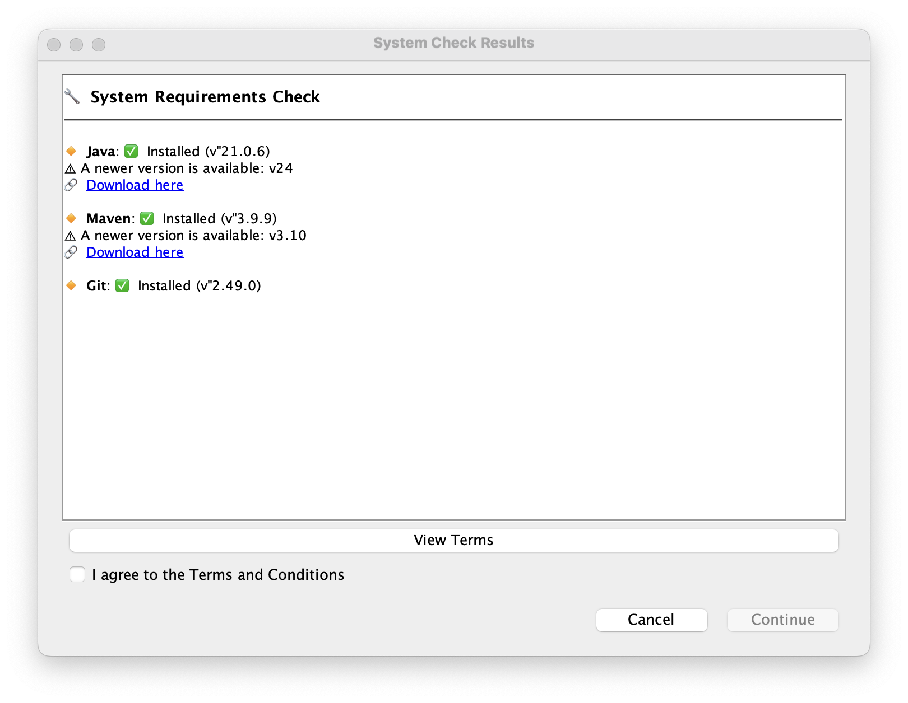
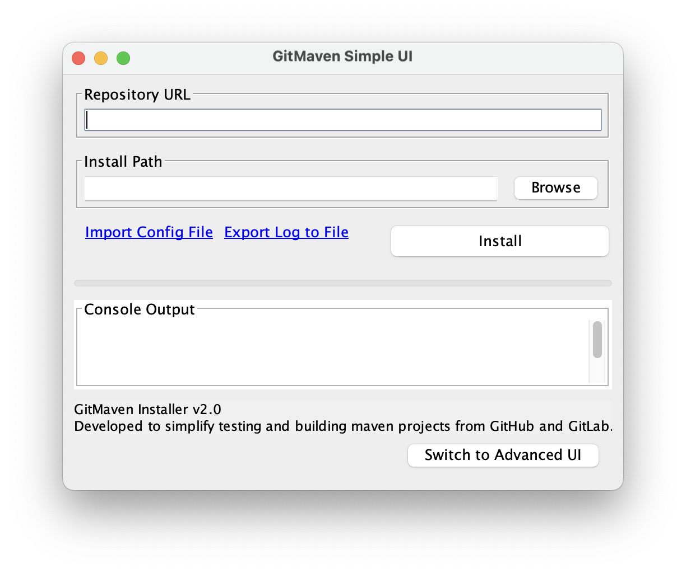

# GitMaven Installer

GitMaven Installer is a cross-platform desktop application designed to simplify the process of cloning Maven-based projects from GitHub or GitLab, building them, and creating launchable shortcuts on Windows, macOS, and Linux systems.

## Developer Setup Notes

If the **Maven project you are cloning** does not already package its dependencies into a single runnable JAR, you’ll need to add the following plugin to its `pom.xml`. This ensures the output is a "fat JAR" that includes all required libraries, making shortcut execution possible on the target system.

### ✅ Maven Assembly Plugin

Add this configuration inside the cloned project's `pom.xml` to bundle all dependencies into a single JAR:

```xml
<plugin>
    <groupId>org.apache.maven.plugins</groupId>
    <artifactId>maven-assembly-plugin</artifactId>
    <version>3.4.2</version>
    <configuration>
        <finalName>your-project-name</finalName>
        <appendAssemblyId>false</appendAssemblyId>
        <archive>
            <manifest>
                <mainClass>your.package.name.YourMainClass</mainClass>
            </manifest>
        </archive>
        <descriptorRefs>
            <descriptorRef>jar-with-dependencies</descriptorRef>
        </descriptorRefs>
    </configuration>
    <executions>
        <execution>
            <id>make-fat-jar</id>
            <phase>package</phase>
            <goals>
                <goal>single</goal>
            </goals>
        </execution>
    </executions>
</plugin>
```

## Notes:
    Replace your.project.name with your actual project name.

    Replace your.package.name.YourMainClass with the full path to your class that contains public static void main(String[] args).

    appendAssemblyId=false will prevent Maven from appending -jar-with-dependencies to the output JAR file name.

    The jar-with-dependencies descriptor ensures that the JAR includes all external libraries.

## Features

- ✨ Graphical User Interface (GUI) using Java Swing
- 💻 Cross-platform support: **Windows**, **macOS**, and **Linux**
- 🚀 Clone repositories from GitHub/GitLab using HTTPS or SSH
- 📚 Branch selection and fetching
- ⛏ Build Maven projects automatically
- ✅ System requirements check for Java, Git, and Maven
- 🔍 Read and display project README.md
- 📄 Fetch and display project owner info (GitHub/GitLab)
- 🔹 Optional custom Maven repository path
- ⚙ Create OS-specific desktop shortcuts for the built JAR
    - **Windows**: `.lnk` file on Desktop and optionally Start Menu
    - **macOS**: `.app` bundle with optional Dock pinning
    - **Linux**: `.desktop` file or Flatpak manifest for Applications menu
- 🌟 Custom icon and application name support
- 🧩 **Import Configuration Files** to quickly restore previously saved setup
- 🧾 **Export Console Logs** for debugging or sharing build/install output
- 🧠 User-friendly and guided UI to simplify setup for non-technical users


## Requirements

Before running GitMaven Installer, ensure the following are installed:

- Java 17+ (tested with Java 21 and Java 24)
- Maven 3.10+
- Git 2.40+

## Installation

1. Clone or download this repository.
2. Build the project using Maven:

```bash
mvn clean install
```

3. Run the application:

```bash
java -jar target/MavenInstaller-2.0-SNAPSHOT.jar
```

## Usage

1. **Launch the Application**  
   Run the built JAR file to start the graphical interface.

2. **Check Requirements**  
   The application verifies if Java, Git, and Maven are installed, and provides version info with helpful download links if anything is missing.

3. **Simple and Interactive UI**  
   GitMaven Installer provides a clean and intuitive Java Swing-based interface that guides you through each step without needing command-line experience.

4. **Enter Repository URL**  
   Paste the GitHub or GitLab repository URL (supports HTTPS and SSH formats).

5. **Fetch Branches**  
   Click "Fetch Branches" to retrieve and select from available Git branches.

6. **Set Install Path**  
   Select the folder where you want to clone and build the project.

7. **Custom Maven Repo (Optional)**  
   Specify a custom local Maven repository path if you prefer not to use the default `~/.m2`.

8. **Clone & Build**
    - Clone the selected branch of the repository.
    - Automatically detect if it's a Maven project and build it using `mvn install`.
    - Extracts and displays the `README.md` content and project owner info.

9. **Create Shortcut**
    - Define the application name and optional icon.
    - OS-specific shortcut creation:
        - **Windows**: `.lnk` file on Desktop and optionally Start Menu (via `mslinks`)
        - **macOS**: `.app` bundle in `~/Applications` with optional Dock pinning (via AppleScript)
        - **Linux**: `.desktop` launcher or Flatpak package in `~/.local/share/applications`

10. **Export Logs**  
    Save the build and execution logs from the console output panel for debugging or reference.

11. **Import Configuration Files**  
    Load previously saved configuration values to pre-fill input fields and streamline repetitive setup.

## Architecture

The application is structured into several key components:

- **UI Layer**: Built with Java Swing, managed in `GitMavenCloneUI.java`.
- **Git Operations**: Classes under `FetchGitInfo` handle cloning, branch fetching, and owner info from GitHub and GitLab.
- **Build System**: Uses `RunMavenBuild.java` and `PomHelper.java` to locate and compile Maven projects.
- **Installer Creation**: Platform-specific logic:
    - `WindowsInstaller.java` using `mslinks`
    - `MacInstaller.java` using AppleScript and `.app` bundles
    - `LinuxInstaller.java` supporting both `.desktop` and Flatpak manifests
- **Helpers**: Utilities like `JarFinder.java`, `OperationSystemChecker.java`, and `RepositoryHelper.java`
- **Validation**: `RequirementsChecker.java` checks for Java, Git, and Maven and prompts user before continuing


## Screenshots
<p float="left">
  
  
</p>


## Supported Repository Hosts

- GitHub (public and private)
- GitLab (with optional access token)

## Developer Notes

- This tool uses `mslinks` for Windows shortcut creation.
- On macOS, AppleScript is used to create `.app` bundles and Dock integration.
- On Linux, Flatpak manifest creation is supported with fallback to `.desktop` files.
- All file paths are handled with cross-platform support.

## License

This project is released under the MIT License.
